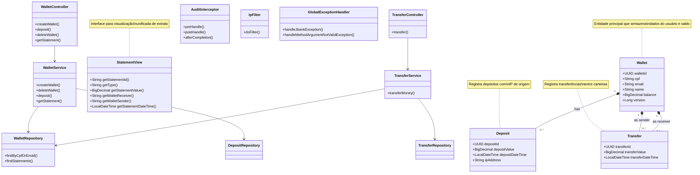

# Sistema Bancário Digital - JBank

## Visão Geral
Sistema bancário digital que permite criação de carteiras virtuais, depósitos e transferências entre usuários, com registro completo de transações para extrato.

## Tecnologias Utilizadas
- **Backend**: Java 21, Spring Boot 3.x
- **Banco de Dados**: MySQL (com suporte a UUID)
- **Segurança**: Validação de IP, Auditoria de requisições
- **Exception**: Problem Details for HTTP APIs (RFC 7807)

## Funcionalidades Principais
- Criação e exclusão de carteiras virtuais
- Depósitos com registro de IP de origem
- Transferências entre usuários com verificação de saldo
- Extrato com paginação e classificação de operações (crédito/débito)
- Auditoria completa de todas as operações

## Diagrama de Arquitetura

## Endpoints Principais

### Carteiras
- **POST /wallets - Cria nova carteira**

- **DELETE /wallets/{walletId} - Remove carteira (se saldo zero)**

- **POST /wallets/{walletId}/deposits - Realiza depósito**

- **GET /wallets/{walletId}/statements - Obtém extrato**

## Transferências
- **POST /transfers - Realiza transferência entre carteiras**

## Tratamento de Erros
### O sistema utiliza Problem Details (RFC 7807) para respostas de erro, com:

- **Detecção automática de campos inválidos**

- **Mensagens claras para erros de negócio**

- **Hierarquia de exceções customizadas**
